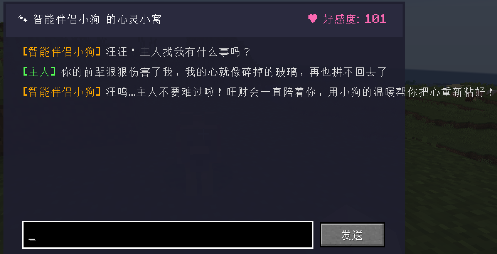
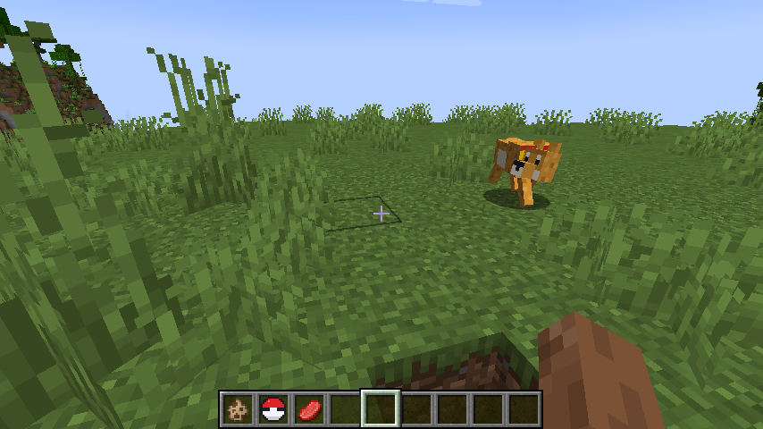

# 🐶 PokePet DeepSeek Dog

[English](README_EN.md) | [简体中文](README.md)

> An embodied AI companion dog mod for Minecraft powered by **DeepSeek API**, featuring **Pokéball-style capture**, real-time world perception, thought bubbles, and acrobatic skills!

---

## 📸 In-Game Screenshots

| Custom Pet Chat Dialog UI | In-Game Companion & World Radar |
| :---: | :---: |
|  |  |

---

## ✨ Key Features

- 🐾 **Chinese Rural Dog Texture**: Warm golden fur, white tummy, black snout, and dynamic high-frequency tail wagging when close to owner.
- 🧠 **DeepSeek Official AI Brain**:
  - **Embodied World & Player Perception**: Detects owner's health, hunger, held items, dimension, biome, and senses nearby Creepers within 12 blocks!
  - **Custom Chat GUI**: Sneak + Right-click empty hand to open chat dialog. Dual-key bound memory (`DogUUID + PlayerUUID`), text wrapping, and scrollable history.
  - **In-Game GUI Config**: Click `⚙ API Config` in the chat window to enter your key directly. Saved locally in config, **0% key leakage in Git repositories**.
- 💭 **Dual-Reflex Thought Bubbles**:
  - Emergency reflex: Instant alert on Creeper nearby or low health (**0ms response, 0 Token consumed**).
  - Ambient thoughts: Micro-context generation with 15s global rate-limiting to **prevent token explosion**.
- 🔴 **Pokéball Capture System**:
  - Empty ball right-click dog: Captured with particle trail into an enchanted glowing full ball.
  - Full ball right-click anywhere: Parabolic arc throw, aerial burst with totem particles, dog glides down smoothly.
- ⚡ **Pet Skill Command Wheel** (Right-click empty ball anywhere):
  - 🚁 **Helicopter Tail Flight**: Tail rotates 360° at high speed into a propeller, gentle breeze sound, keeps 2-block distance伴飞.
  - 🦖 **Giant Growth**: Expands body to 2.6x, smart safe-space check, immune to suffocation in blocks.
  - 🤸 **Acrobatic 360° Backflip**: Leaps into air and performs a 360-degree backflip with firework particles, affection +5!

---

## 🚀 Quick Start

### 1. Requirements
* **Minecraft Version**: `1.20.1`
* **Mod Loader**: `Fabric Loader >= 0.19.5`
* **Dependency**: `Fabric API >= 0.92.12`
* **Java Environment**: `Java 17+`

### 2. Installation
1. Download the latest `aicreater-1.0.0.jar` from Releases;
2. Drop it into your `.minecraft/mods` folder;
3. Launch Minecraft!

### 3. Setup DeepSeek API
1. Spawn your companion dog using the spawn egg;
2. Hold **Shift + Empty Hand Right-Click** the dog to open the chat window;
3. Click the **`⚙ API Config`** button at top right;
4. Paste your DeepSeek API Key (`sk-...`), click **"Save & Apply"** and enjoy chatting!

---

## 🎮 Controls & Interactions

| Action | How to Trigger | Result |
| :--- | :--- | :--- |
| **Pet / Toggle Sit** | Empty hand right-click dog | Emits hearts and whine, toggles sitting/standing |
| **Feed Food** | Right-click with bone / cooked beef / porkchop | Heals health and increases Affection |
| **Open AI Chat** | Sneak + Empty hand right-click dog | Opens dedicated conversation GUI |
| **Capture Pet** | Right-click dog with Pet Ball | Dog captured into ball with vortex particles |
| **Release Pet** | Right-click with full ball anywhere | Parabolic aerial release with golden totem burst |
| **Skill Wheel** | Right-click with empty ball anywhere | Opens skill menu (Flight, Giant, Backflip) |

---

## 📄 License

This project is licensed under the [MIT License](LICENSE).
